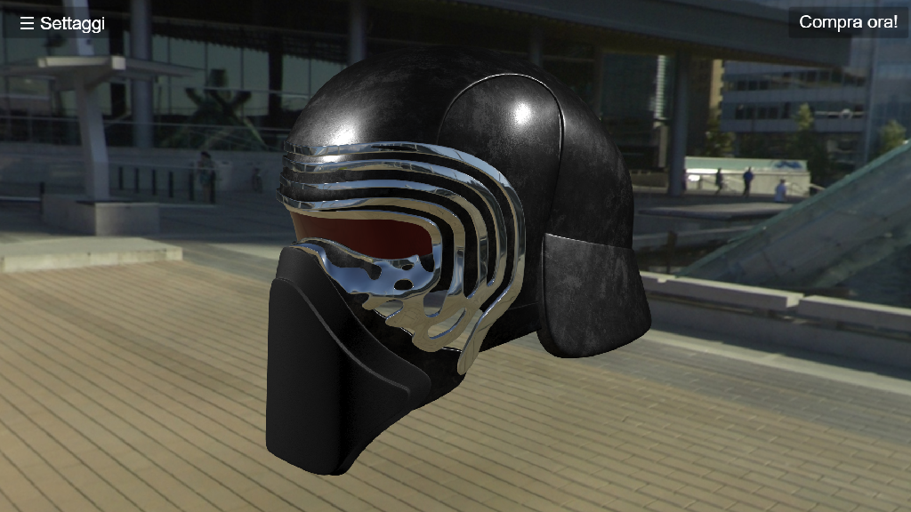
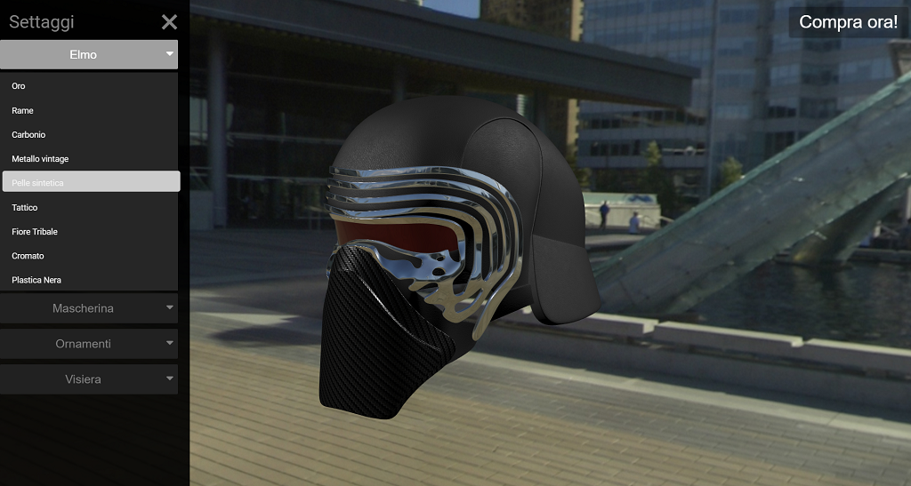

# Overview del progetto
Il progetto simula un possibile configuratore online per l'acquisto di un casco iconico come quello di Kylo Ren, dal mondo di Star Wars. Si possono modificare a piacimento le quattro parti fondamentali del casco, attraverso un menu a scomparsa, che fornisce le varie opzioni di personalizzazione e i materiali a disposizione.

# Struttura del progetto
Per accedere al configuratore, bisogna aprire il file index.html, ed eseguirlo in locale. Per farlo ho usato XAMPP, per ulteriori informazioni vedere documentazione THREE.js.
La cartella "kylo_rens_helmet_realistic" contiene il modello glTF; "textures" contiene le texture usate per creare i materiali utilizzati nel progetto.
Le fonti utilizzate per la realizzazione del progetto sono linkate nel file credits.md.

# Fasi di implementazione
- Ricerca modello
- Ricerca texture
- Inserimento luci, EM e IEM
- implementazione shaders
- Realizzazione struttura del sito e inserimento scena

## Aspetti/funzioni da implementare
- aggiungere pulsante e relativa funzione per cambiare sfondo;
- aggiungere restrizione massimo un menu attivo per volta;
